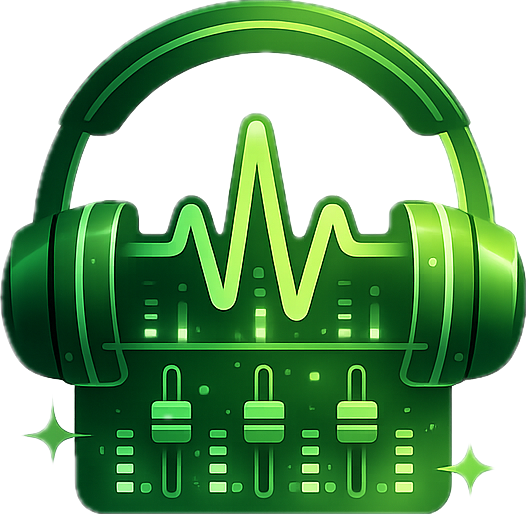

<div align="center">

[](https://github.com/Eps-Acoustic-Revolution-Lab/EAR-Audio-Preview/actions/workflows/ci.yml)
[](LICENSE)
[](https://www.typescriptlang.org/)
[](https://code.visualstudio.com/api/extension-guides/custom-editors)
[](https://marketplace.visualstudio.com/items?itemName=Eps-Acoustic-Revolution-Lab.ear-audio-preview)

</div>

<br />

<div align="center">
  

  # EAR Audio Preview

  **A professional-grade audio analysis tool inside VS Code.**

  Waveform · GPU Spectrogram · Goniometer · Phase Correlation
  <br />LUFS / F0 / Onset Timeline · True Peak · Stereo Metering · WAV Export

  [](https://github.com/Eps-Acoustic-Revolution-Lab)

</div>

<br />

> [!NOTE]
> This project began as a fork of [sukumo28/vscode-audio-preview](https://github.com/sukumo28/vscode-audio-preview) but has been **comprehensively rebuilt** — every major subsystem (decode, FFT, rendering, metering, loudness, configuration) was replaced or substantially rewritten. The only surviving artifact from upstream is the `postMessage` wire protocol. See [What's new](#whats-new) for details.

---

## What's new in v0.4.0

- **CQT spectrum analyzer** — a PAZ-style Constant-Q spectrum mode in the Live Spec pane: variable-Q psychoacoustic bands (Q≈3.85–6.97 below 250 Hz, ≈10 above), left-edge rendering, low-freq trapezoids + smooth highs, and a max-hold Peak Hold envelope (double-click to clear)
- **Deep dive** — read the story behind it: [English](doc/blog/cqt-spectrum-analyzer.en.md) · [中文](doc/blog/cqt-spectrum-analyzer.md) — how we reverse-engineered PAZ Analyzer's rendering and adapted it to the webview

## What's new in v0.3.0

- **Headphone curve correction** — AutoEq PEQ compensation in the Transport FAB Monitor panel; search models, visualize curves, bypass or apply in real time
- **Curve Correction overlay** — `Cmd+Shift+E` / `Ctrl+Shift+E` opens the full EQ editor; save profiles per-workspace or globally
- **Extension-host AutoEq proxy** — headphone metadata only (no audio upload); CSP-safe access to [autoeq.app](https://autoeq.app)

## What's new in v0.2.0

- **Marketplace release** — install directly from the [Visual Studio Marketplace](https://marketplace.visualstudio.com/items?itemName=Eps-Acoustic-Revolution-Lab.ear-audio-preview)
- **Transport FAB** — compact bottom-left play / volume / monitor controls; seek bar integrated into the STFT waveform
- **Settings overlay** — gear popover for Options, Player, and Edit & Export (replaces the old bottom-sheet FAB)
- **Edit & Export** — full region select, preview listen, and WAV export workflow
- **Loudness timeline** — stacked LUFS, F0 (PitchYinFFT), and onset-flux strips on a shared time axis
- **Extension-host Essentia** — STFT and sequence analysis offloaded to the Node.js host for CSP-safe processing
- **EAR identity** — extension ID `Eps-Acoustic-Revolution-Lab.ear-audio-preview`; settings namespace `EarAudioPreview.*`

See [CHANGELOG.md](./CHANGELOG.md) for the full release history.

### Compared to upstream

The upstream extension pioneered the VS Code Custom Editor model for audio, but its monolithic FFmpeg WASM decoder required Docker to build. This project replaces the entire stack while keeping the same extension-host-to-webview message contract.

| Subsystem | Upstream | This project |
|---|---|---|
| **Decode** | Single FFmpeg WASM (Docker build) | Per-format WASM decoders + Web Audio fallback |
| **Spectrogram** | Canvas2D point-by-point | WebGL2 GPU texture renderer (~7× faster) |
| **FFT** | Ooura only | Ooura + Essentia.js (multi-window, LUFS) |
| **Metering** | Basic waveform only | LUFS, true peak, goniometer, phase correlation spectrum, stereo level meter |
| **Live monitoring** | None | Full analyser tap: L/R/M/S solo, 5-band monitor matrix |
| **Loudness** | None | Offline EBU R128 profile + live loudness-worklet + F0/onset strips |
| **Onboarding** | Docker + manual build | `npm install && npm run webpack` |

---

## Installation

### For Users

**Recommended — VS Code Marketplace:**

1. Open VS Code → Extensions (`Cmd+Shift+X` / `Ctrl+Shift+X`)
2. Search for **EAR Audio Preview** or publisher **Eps-Acoustic-Revolution-Lab**
3. Click **Install**

Or install from the command line:

```sh
code --install-extension Eps-Acoustic-Revolution-Lab.ear-audio-preview
```

**Alternative — VSIX file** (e.g. from [GitHub Releases](https://github.com/Eps-Acoustic-Revolution-Lab/EAR-Audio-Preview/releases)):

```sh
code --install-extension ear-audio-preview-*.vsix
```

### For Developers

```sh
git clone git@github.com:Eps-Acoustic-Revolution-Lab/EAR-Audio-Preview.git
cd EAR-Audio-Preview
npm install
npm run webpack
```

Press **F5** in VS Code, open any audio file, and the editor activates automatically.

To make Audio Preview the default for audio files:

```jsonc
"workbench.editorAssociations": {
  "*.wav":  "earAudioPreview.audioPreview",
  "*.mp3":  "earAudioPreview.audioPreview",
  "*.flac": "earAudioPreview.audioPreview",
  "*.ogg":  "earAudioPreview.audioPreview",
  "*.opus": "earAudioPreview.audioPreview",
  "*.aac":  "earAudioPreview.audioPreview",
  "*.m4a":  "earAudioPreview.audioPreview"
}
```

### Migrating from upstream or older builds

If you previously used [sukumo28/vscode-audio-preview](https://github.com/sukumo28/vscode-audio-preview) or an earlier EAR build, update `settings.json`:

```jsonc
// Editor associations: wavPreview.audioPreview → earAudioPreview.audioPreview
"workbench.editorAssociations": {
  "*.wav": "earAudioPreview.audioPreview"
}

// Settings namespace: WavPreview.* → EarAudioPreview.*
"EarAudioPreview.autoAnalyze": true
"EarAudioPreview.analyzeDefault": { }
```

Analyze UI cache stored under the old `wavPreview.analyzeUiCache.v1` key is not migrated; panel settings reset once after upgrade.

---

## Capabilities

### Supported Formats

| Extension | Decoder |
|-----------|---------|
| `.wav` `.aac` `.m4a` `.sph` | Browser `decodeAudioData` |
| `.mp3` | `mpg123-decoder` (WASM worker) |
| `.flac` | `@wasm-audio-decoders/flac` |
| `.ogg` | Ogg Vorbis WASM |
| `.opus` | `ogg-opus-decoder` |

Files stream from the extension host in 3 MB chunks. The webview assembles the full buffer, then decodes in one pass. A circular SVG progress ring on the FAB button tracks transfer + decode progress.

### Workspace Panes

Four tabbed views, each mounted lazily on first access:

| Pane | Purpose |
|------|---------|
| **STFT** | Multi-channel waveform + GPU spectrogram with drag-to-zoom on time, frequency, and amplitude axes. Right-click to reset any axis. |
| **Live Spec** | Real-time goniometer (3 modes), per-bin phase correlation spectrum, log-spaced spectral bars with peak hold and configurable HF tilt. Expandable to fullscreen. |
| **Loudness** | Offline EBU R128 profile over the full file — integrated/short-term/momentary LUFS curves, true-peak markers, LRA, PLR. Drag to select a time region. |
| **Edit & Export** | WAV export of selected region (EasyCut). |

#### STFT Pane (Default)

The STFT pane displays waveform and spectrogram side-by-side:

- **Waveform** — Multi-channel amplitude display with RMS, peak, and true-peak readouts on hover. Drag the resize handle between waveform and spectrogram to adjust heights.
- **Spectrogram** — GPU-accelerated frequency-time visualization. Supports linear, log, and mel frequency scales. Auto-FFT mode adapts window size to visible time range.
- **Zoom** — Click and drag to zoom into a time/frequency region. Hold `Ctrl` to constrain to time axis, `Shift` for frequency/amplitude axis.
- **Reset** — Right-click to reset view. `Ctrl+right-click` resets time only, `Shift+right-click` resets frequency/amplitude only.
- **Cue position** — Click anywhere to set the playback cue (white vertical line).

#### Live Spec Pane

Real-time analysis during playback:

- **Goniometer** — Three modes: Polar Sample (scatter), Polar Level (directional gate), Lissajous (X-Y). Shows stereo field and phase relationships.
- **Phase Correlation Spectrum** — Per-frequency-bin correlation coefficient ρ ∈ [−1, 1]. Red = out-of-phase, green = in-phase.
- **Live Spectrum Analyzer** — Log-spaced frequency bars with configurable release rate (dB/s), peak hold, and HF tilt (0–6 dB/oct).
- **Fullscreen** — Click **↗** to expand. Press `Esc` or right-click to exit.

#### Loudness Pane

Offline EBU R128 loudness profile with stacked timeline strips (shared time axis):

- **LUFS strip** — Integrated (I), short-term (S), and momentary (M) loudness over time. BSpline-smoothed for display. Timeline padding aligns with the waveform above.
- **F0 strip** — Fundamental frequency (Hz, log scale) via Essentia `PitchYinFFT`; unvoiced frames are left blank.
- **Onset strip** — Spectral flux onset strength via Essentia `Flux` (half-rectified L2).
- **True peak markers** — Red markers on the LUFS strip indicate true-peak excursions above 0 dBTP.
- **LRA & PLR** — Loudness Range and Peak-to-Loudness Ratio displayed in the info panel.
- **Time selection** — Drag across any strip to select a region and re-analyze with new bounds.
- **Layout** — Three compact horizontal strips; tab re-entry keeps stable height (no viewport stretch).

#### Edit & Export Pane

Export selected audio regions:

- **EasyCut** — Select a time range in any pane, then export as WAV from this tab.
- **Format** — Exports preserve original sample rate and bit depth.

### Common Operations

#### Playback Control

- **Play/Pause** — Click the play button in the player bar, or press `Space` (if enabled in settings)
- **Seek** — Click anywhere on the seek bar, or click on the waveform/spectrogram to set cue position
- **Volume** — Adjust the volume slider in the player bar. Switch between dB and linear scale in Player settings

#### Zoom & Navigation

- **Zoom in** — Click and drag on waveform or spectrogram to select a region
- **Constrained zoom** — Hold `Ctrl` while dragging to zoom time axis only, `Shift` for frequency/amplitude axis only
- **Reset zoom** — Right-click on the graph. `Ctrl+right-click` resets time only, `Shift+right-click` resets frequency/amplitude only
- **Resize waveform** — Drag the horizontal handle between waveform and spectrogram to adjust heights

#### Analysis & Inspection

- **Hover readout** — Hover over waveform to see RMS, peak, and true-peak values at that time position
- **Frequency readout** — Hover over spectrogram to see frequency and dB level
- **Select region** — Drag to select a time range, then switch to Edit & Export pane to export as WAV
- **Re-analyze** — Change settings in the Options tab, then click **Save** to redraw spectrogram

#### Live Monitoring

- **Enable live analysis** — Check "Show live analysis" in Options tab to activate real-time meters
- **Solo channels** — Use the monitoring bar below the info table to solo L, R, M (mid), or S (side)
- **5-band monitor** — Configure crossover edges in the monitoring matrix for frequency-specific solo
- **Fullscreen live spec** — Click **↗** in Live Spec pane to expand. Press `Esc` or right-click to exit

### Live Monitoring Details

Enable **Show live analysis** in the FAB settings sheet. A dedicated analyser node taps the playback graph without affecting the main output:

- **Stereo level meter** (right column) — L/R or M/S RMS + peak bars, peak-hold with 2 s decay, clip LEDs. Resizable width. Green → yellow → red gradient.
- **Goniometer** — three sound-field modes: **Polar Sample** (scatter), **Polar Level** (Insight-style directional gate), and **Lissajous**. WebGL2 or Canvas2D rendering.
- **Phase correlation spectrum** — per-frequency-bin ρ ∈ [−1, 1] plus broadband correlation readout.
- **Live spectrum analyzer** — log-spaced bars, configurable release rate (dB/s), peak hold, and per-octave tilt (0–6 dB/oct).
- **Monitoring matrix** — solo L, R, M (mid), or S (side). 5-band parametric monitor with configurable crossover edges.
- **Fullscreen overlay** — click **↗** to expand the Live Spec pane; **Esc** or right-click to close.

### FFT & Analysis

Two backends, switchable at any time:

| Backend | Strengths |
|---------|-----------|
| **Ooura** (default) | Pure JS, instant startup, fast for most workloads |
| **Essentia.js** | Hann, Hamming, Blackman-Harris, Triangular windows + offline LUFS |

Frequency scales: **linear**, **log piecewise**, or **mel** (configurable filter bank). Optional **auto-FFT** mode adapts window size to the visible time range for optimal frequency resolution. **High-resolution mode** doubles spectrogram pixel dimensions for pixel-dense displays.

### Loudness & Dynamics

- **Offline profile** — `LoudnessService` runs an `OfflineAudioContext` with `loudness-worklet` over the full file. Produces LUFS-M/S/I curves, LRA, PLR, and max true-peak. BSpline-smoothed for display.
- **True peak** everywhere — `ebur128-wasm` powers per-window true-peak in waveform hover readouts, per-buffer true-peak in the level meter, and full-file true-peak in the info table.
- **Live EBU R128** — `loudness-worklet` provides real-time LUFS-M/S/I during playback. Session max true-peak is tracked continuously.

### Graph Interaction

Consistent across waveform, spectrogram, and loudness panes:

| Action | Result |
|--------|--------|
| **Click** | Set cue position (white line) |
| **Drag** | Select range → re-analyze with new bounds |
| **Ctrl + drag** | Constrain to time axis only |
| **Shift + drag** | Constrain to value axis only |
| **Right-click** | Reset view range (Ctrl/Shift for single-axis reset) |
| **Hover** | RMS, peak, true-peak, and frequency readout |

### Playback

Full Web Audio graph: **source → HPF/LPF biquad filters → gain → destination**. Optional auto-play on seek, spacebar toggle, dB or linear volume scale. The live monitoring sub-graph (splitter → analysers → gain matrix → merger) connects in parallel when enabled.

---

## Architecture

```
┌── Extension Host (Node.js) ────────────────────────────────────┐
│  AudioPreviewEditorProvider                                    │
│  Chunked streaming (3 MB) · VS Code settings · globalState     │
└──────────────────────┬─────────────────────────────────────────┘
                       │ postMessage: CONFIG · DATA · RELOAD
┌──────────────────────▼─────────────────────────────────────────┐
│  Webview (browser sandbox)                                     │
│                                                                │
│  DecoderFactory ──→ PlayerService (Web Audio graph + live tap) │
│      │                    │                                    │
│      │                    └──→ Live meters (Level · Gonio ·    │
│      │                         Spectrum · Phase Correlation)   │
│      │                                                         │
│      └──→ AnalyzeService (Ooura / Essentia STFT)               │
│                └──→ SpectrogramRenderer (WebGL2, twgl.js)      │
│                                                                │
│  LoudnessService (OfflineAudioContext + ebur128-wasm)          │
│                                                                │
│  Workspace panes: STFT | Live Spec | Loudness | Edit           │
│  All services extend Service → EventTarget                     │
│  All UI extends Component → Disposable                         │
└────────────────────────────────────────────────────────────────┘
```

Message types: `src/message.ts`. 
Benchmarks (Apple Silicon, 300 s stereo file): spectrogram CPU pack **~41 ms → ~6 ms** with WebGL2.

---

## Usage

### Getting Started

1. **Open an audio file** — Click any supported audio file (`.wav`, `.mp3`, `.flac`, `.ogg`, `.opus`, `.aac`, `.m4a`) in VS Code. The EAR Audio Preview editor opens automatically.

2. **Set as default editor** (optional) — Add to your `settings.json`:
   ```jsonc
   "workbench.editorAssociations": {
     "*.wav":  "earAudioPreview.audioPreview",
     "*.mp3":  "earAudioPreview.audioPreview",
     "*.flac": "earAudioPreview.audioPreview",
     "*.ogg":  "earAudioPreview.audioPreview",
     "*.opus": "earAudioPreview.audioPreview",
     "*.aac":  "earAudioPreview.audioPreview",
     "*.m4a":  "earAudioPreview.audioPreview"
   }
   ```

3. **Navigate the interface** — The editor loads with the **STFT** pane active, showing waveform and spectrogram. Switch between workspace panes using the tabs below the player bar.

### UI Layout

| Element | Location | Role |
|---------|----------|------|
| **Info table** | Top-left | Metadata: format, sample rate, bit depth, duration, true peak |
| **Workspace tabs** | Top bar | STFT · Live Spec · Loudness · Edit & Export (ear-eq sliding focus) |
| **Transport FAB** | Bottom-left | Collapsed play/volume knob; expands to seek, monitor solo, level meter |
| **Meta FAB** | Bottom-left (stacked) | Settings overlay: Options / Player / Edit & Export |
| **Seek bar** | STFT pane | Time scrubber lives in the waveform area (not a global header) |

### Settings

Click the FAB (bottom-left) to open the settings sheet. Three tabs:

#### Options Tab

**Common Settings:**
- **Time range** — Set min/max time bounds for analysis (seconds)

**Waveform Settings:**
- **Visible** — Toggle waveform display on/off
- **Amplitude range** — Set min/max amplitude bounds for display

**Spectrogram Settings:**
- **Visible** — Toggle spectrogram display on/off
- **High-resolution mode** — Doubles canvas pixel dimensions for sharper rendering on high-DPI displays
- **Window size** — FFT window size (256–32768 samples, or Auto)
  - **Auto mode** — Adapts window size to visible time range for optimal frequency resolution
- **Window type** — Hann, Hamming, Blackman-Harris, or Triangular
- **FFT backend** — Ooura (fast, pure JS) or Essentia.js (multi-window support, offline LUFS)
- **Frequency scale** — Linear, log piecewise, or mel
- **Frequency range** — Set min/max frequency bounds (Hz)
- **dB range** — Set min/max dB bounds for spectrogram color mapping

**Live Analysis Settings:**
- **Show live analysis** — Enable real-time meters during playback (goniometer, spectrum, level meter)
- **Goniometer mode** — Polar Sample, Polar Level, or Lissajous
- **Spectrum release rate** — Decay speed in dB/s (1–60 dB/s)
- **Spectrum peak hold** — Peak hold duration in seconds (0–5 s)
- **HF tilt** — High-frequency tilt compensation (0–6 dB/oct)

#### Player Tab

**Playback Controls:**
- **Volume scale** — dB or linear scale
- **Initial volume** — Default volume on load (dB or linear, depending on scale)
- **Enable space key play** — Toggle playback with spacebar
- **Enable seek to play** — Auto-play when seeking to a new position

**Filters:**
- **Enable HPF** — High-pass filter on playback
- **HPF frequency** — Cutoff frequency in Hz (10 Hz – Nyquist)
- **Enable LPF** — Low-pass filter on playback
- **LPF frequency** — Cutoff frequency in Hz (10 Hz – Nyquist)
- **Match filter frequency to spectrogram** — Auto-sync filter cutoffs with spectrogram frequency range

#### EasyCut Tab

**Export Settings:**
- **Time range** — Select start/end time for export (inherited from selection in other panes)
- **Export** — Click to export selected region as WAV file

**Save Button:**
- Click **Save** at the bottom of the settings sheet to redraw the spectrogram with current analysis settings. Settings persist automatically to VS Code `globalState` (debounced, 500 ms).

**Headphone curve correction (Monitor):**
- Open the Transport FAB → **Monitor** section → click the profile row (or press `Cmd+Shift+E` / `Ctrl+Shift+E`)
- Search [autoeq.app](https://autoeq.app) for your headphone model, pick measurement + target curve, then **Apply preset**
- **BYPASS** toggles real-time EQ without clearing the profile
- **Save to workspace** writes `.vscode/ear-headphone-eq.json`; **Save globally** stores in extension `globalState`
- EQ applies to **live playback only** in v1 (not baked into Edit & Export)

---

## Network & privacy

The **curve correction** feature contacts **https://autoeq.app** via the **extension host** (Node.js) to:

- List headphone measurement entries and target curves
- Request parametric EQ (PEQ) presets for a selected model

**Your audio files are never uploaded.** Only headphone model metadata (name, measurement source, target label, sample rate) is sent to AutoEq when you apply a preset. The webview cannot call AutoEq directly because the API does not allow cross-origin requests from `vscode-webview://` origins; the extension proxies those HTTP calls instead.

---

## Development

```sh
npm install
npm run webpack-dev    # watch mode
npm test               # Jest (jsdom + jest-canvas-mock)
npm run lint           # ESLint
npm run format         # Prettier
```

| Script | Purpose |
|--------|---------|
| `npm run webpack` | One-shot build → `dist/` |
| `npm run webpack-dev` | Watch + rebuild |
| `npm test` | Unit tests |
| `npm run lint-check` / `format-check` | CI checks |

### Build targets

Three webpack outputs: `dist/extension.js` (Node), `dist/audioPreview.js` (webview), `dist/web/extension.js` (VS Code for Web).

### Key dependencies

| Layer | Packages |
|-------|----------|
| Decode | `mpg123-decoder`, `@wasm-audio-decoders/flac`, `@wasm-audio-decoders/ogg-vorbis`, `ogg-opus-decoder` |
| FFT | `ooura`, `essentia.js` |
| GPU | `twgl.js` (WebGL2) |
| Loudness | `loudness-worklet`, `ebur128-wasm` |

---

## Roadmap

### Done

- [x] Per-format WASM decoders (no Docker)
- [x] WebGL2 GPU spectrogram
- [x] Essentia FFT backend + offline LUFS
- [x] Four workspace panes (STFT / Live Spec / Loudness / Edit)
- [x] Stereo level meter (L/R and M/S, resizable)
- [x] Live log spectrum (peak hold, configurable release, HF tilt)
- [x] Goniometer (polar sample / polar level / Lissajous)
- [x] Frequency-domain phase correlation spectrum
- [x] Live + offline EBU R128 loudness (LUFS, LRA, PLR, true peak)
- [x] `ebur128-wasm` true peak (file, window, buffer levels)
- [x] Live monitoring matrix (L/R/M/S + 5-band solo)
- [x] Mid/side derived offline analysis
- [x] Loudness profile pane with BSpline-smoothed curves
- [x] Auto-FFT window inference from visible time range
- [x] Settings persistence via `globalState`
- [x] Compact workspace chrome (minimal top tab bar, no global transport header)
- [x] Transport FAB — play/volume/monitor in bottom-left popover; seek in STFT pane
- [x] Ear-eq UI tokens — pill controls, sliding focus, segmented controls, knob component
- [x] Hearing protection — optional peak-dBFS mute in Playback settings
- [x] LUFS timeline alignment with waveform (`timelinePlotLayout`)
- [x] Loudness pane layout stability — fixed chart height on tab re-entry
- [x] Edit & Export panel surfaces + ear-eq segmented controls (channels, listen, destination)
- [x] Loudness multi-strip layout — LUFS + F0 (PitchYinFFT) + Onset flux (Essentia)
- [x] Monitoring curve for flat frequency response (AutoEq PEQ, live playback)
- [x] CQT spectrum analyzer (PAZ-style variable-Q, left-edge rendering, Peak Hold) — deep dive: [English](doc/blog/cqt-spectrum-analyzer.en.md) · [中文](doc/blog/cqt-spectrum-analyzer.md)

### Planned

- [ ] Chromagram strip (CQT) or PredominantPitchMelodia for polyphonic melody
- [ ] Optional third-strip feature toggle (Spectral Centroid, etc.)
- [ ] Frequency-weighted RMS (dBA, dB-B, dB-C)
- [ ] Bake headphone EQ into Edit & Export processed output
- [ ] Worker offload for long-file Essentia sequence analysis


---

## Contributing

Bug reports, documentation, and pull requests are welcome.

1. Fork the repo at [Eps-Acoustic-Revolution-Lab/EAR-Audio-Preview](https://github.com/Eps-Acoustic-Revolution-Lab/EAR-Audio-Preview)
2. `git checkout -b feature/amazing-feature`
3. Commit and push
4. Open a Pull Request to the `lab-version` remote

Run `npm test && npm run lint-check` before submitting.

---

## License

MIT — see [LICENSE](./LICENSE).

Original work copyright (c) 2020 [sukumo28](https://github.com/sukumo28). Fork modifications © [earlab](https://github.com/Eps-Acoustic-Revolution-Lab) contributors.

---

## Acknowledgments

- [earlab](https://github.com/Eps-Acoustic-Revolution-Lab) — development and maintenance
- [sukumo28](https://github.com/sukumo28) — original Custom Editor foundation
- [Microsoft custom-editor-sample](https://github.com/microsoft/vscode-extension-samples/tree/main/custom-editor-sample)
- Audio DSP stack: Ooura, Essentia.js, mpg123-decoder, wasm-audio-decoders, loudness-worklet, ebur128-wasm, twgl.js
